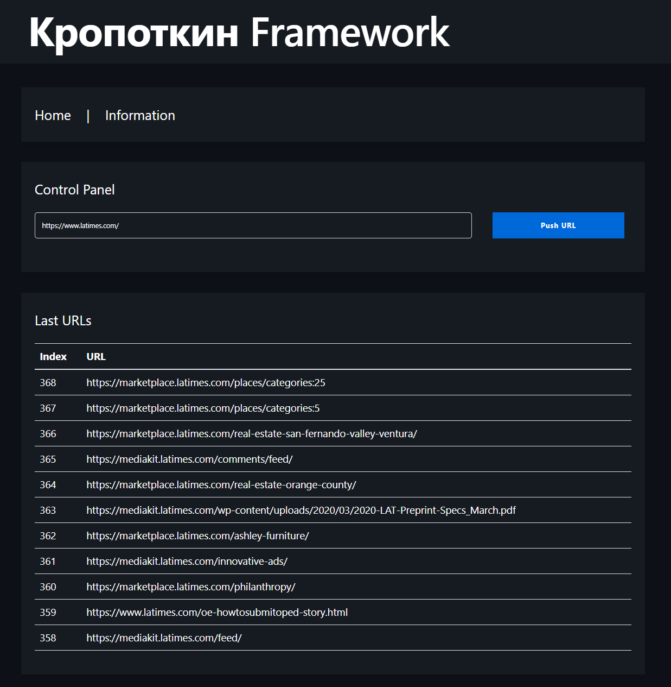
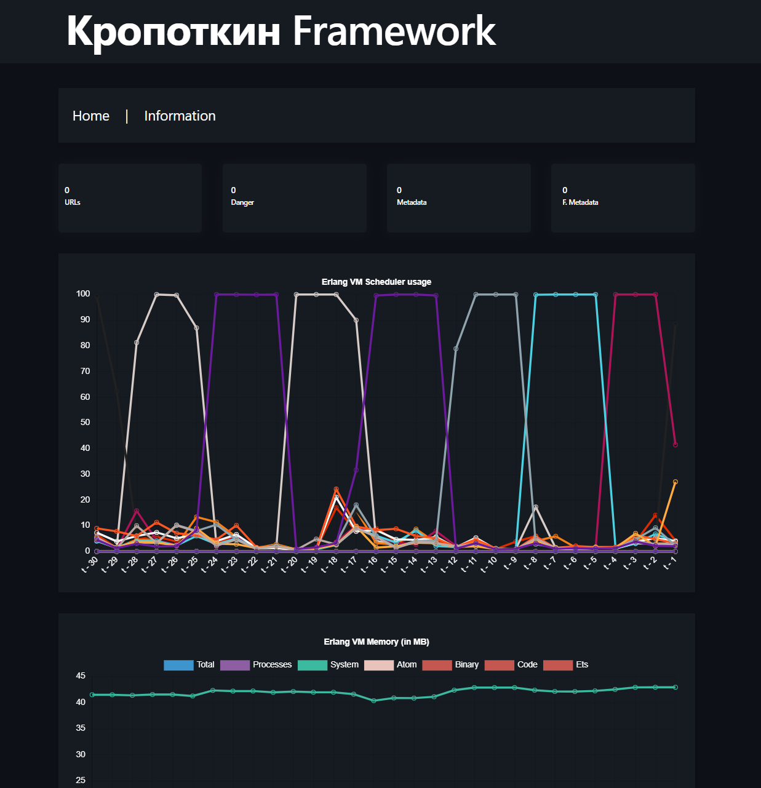

# Krptkn

Krptkn is a spider, metadata extractor, metadata analyzer and report generator.

# Roadmap

- [x] Spider
  - [x] Extract URLs from HTML
  - [x] Dictionary of common directories
  - [x] Extract from Robots.txt and other files
- [x] NIF with libextractor
- [ ] Metadata analyzer
- [x] Metadata filter
- [ ] Report generator
  - [x] Plot generator
  - [x] Metadata frequency analyzer
  - [ ] URL frequency analyzer
- [ ] Control panel
  - [x] Start URL
  - [x] Pause / Stop / Resume
  - [x] Clear RAM / Clear DB
  - [x] Information Leds
- [ ] Quality control
  - [x] Create tests
  - [x] Continuous integration
  - [x] Module documentation
  - [ ] Function documentation
  - [x] Schematics

# Images

Admin Web UI:

Debug Web UI:

# Schematics

Krptkn's data flow:

