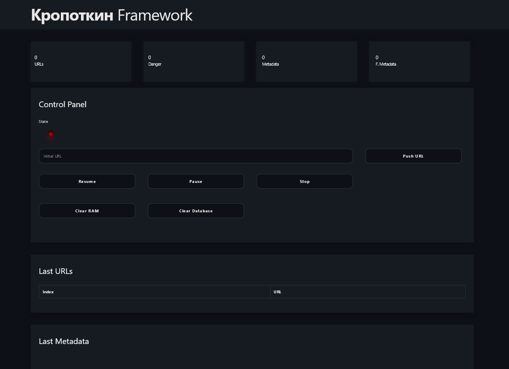
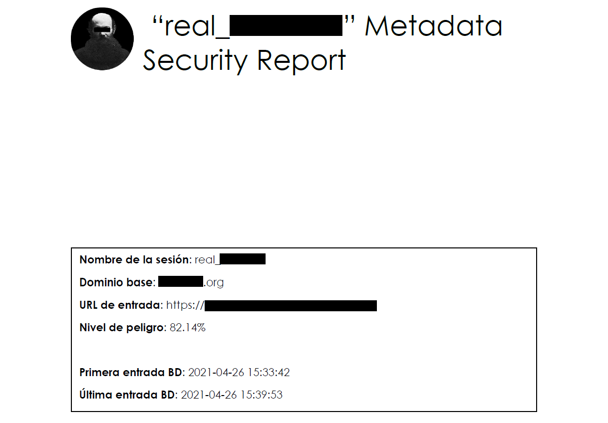
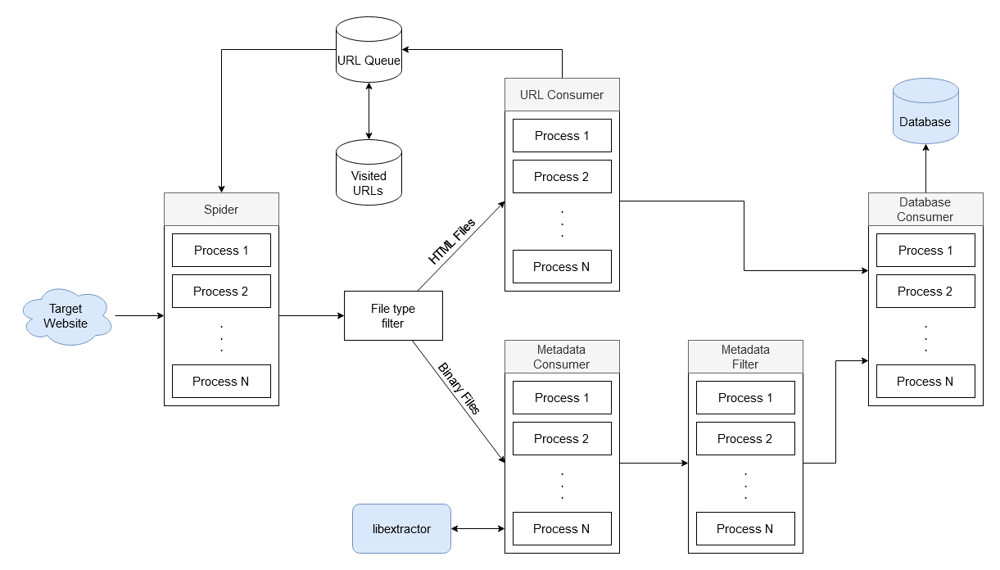

# Krptkn

Krptkn, pronounced /kroh-pot-kin/, is a metadata extraction framework for websites. It contains a spider, metadata extractor, metadata analyzer and report generator.

# Installation
Build both Krptkn and PostgreSQL:
```bash
$ docker-compose build
Building phoenix
[+] Building 235.2s (25/25) FINISHED
```

Run:
```bash
$ docker-compose up
phoenix_1  | [info] Access KrptknWeb.Endpoint at http://localhost:4000
```

# Roadmap

- [x] Spider
  - [x] Extract URLs from HTML
  - [x] Dictionary of common directories
  - [x] Extract from Robots.txt and other files
- [x] Metadata extraction
  - [x] NIF with libextractor
- [x] Metadata filter
- [ ] Report generator
  - [x] Plot generator
  - [x] Metadata frequency analyzer
  - [x] URL frequency analyzer
  - [ ] Add report generation to WUI
- [x] Control panel
  - [x] Start URL
  - [x] Pause / Stop / Resume
  - [x] Clear RAM / Clear DB
  - [x] Information Leds
- [ ] Quality control
  - [x] Module documentation
  - [x] Function documentation
  - [x] Schematics
  - [ ] Create tests
  - [ ] Continuous integration

# Images

Admin Web UI:



Report example:



# Schematics

Krptkn's data flow:


